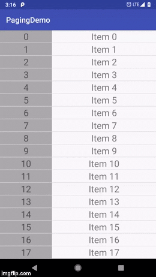

## Android Paging Library - Displaying an Infinite List of Positive and Negative Page Numbers

Read this in other languages: [繁體中文](./README.zh-tw.md)

### Final Result

 &nbsp;&nbsp;&nbsp;&nbsp; 

### Detailed Tutorial

[Android Infinite List - Combining RecyclerView and Android Paging Library](https://medium.com/@hankli0130/android-paging-library-%E5%88%9D%E6%8E%A2datasource-aaf2e74dd546)

## When to Use Which DataSource? 

### ItemKeyedDataSource
Do：When keys are continuous for a Data Item in RecyclerView, use the Data’s Key to find the previous or next piece of data

### PageKeyedDataSource 
Do: When the data source (from a cloud server or other data source) already has a paging function, use the Key of every page to get data

### PositionalDataSource
Do: Use RecyclerView’s absolute position to decide data placement

